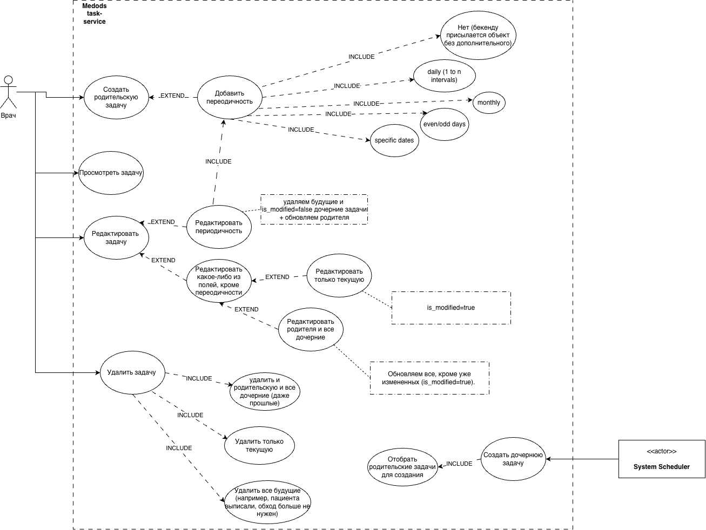

# Task Service

Сервис для управления задачами с HTTP API на Go.

## Требования

- Go `1.23+`
- Docker и Docker Compose

## Быстрый запуск через Docker Compose

```bash
docker compose up --build
```

После запуска сервис будет доступен по адресу `http://localhost:8080`.

Если `postgres` уже запускался ранее со старой схемой, пересоздай volume:

```bash
docker compose down -v
docker compose up --build
```

Причина в том, что SQL-файл из `migrations/0001_create_tasks.up.sql` монтируется в `docker-entrypoint-initdb.d` и применяется только при инициализации пустого data volume.

## Swagger

Swagger UI:

```text
http://localhost:8080/swagger/
```

OpenAPI JSON:

```text
http://localhost:8080/swagger/openapi.json
```

## API

Базовый префикс API:

```text
/api/v1
```

Основные маршруты:

- `POST /api/v1/tasks`
- `GET /api/v1/tasks`
- `GET /api/v1/tasks/{id}`
- `PUT /api/v1/tasks/{id}`
- `DELETE /api/v1/tasks/{id}`

# Дополнения от разработчика
Расширенная версия (с некоторыми нюансами логики) Use Case Diagram для прояснения деталей
и закрытия пробелов в понимании требований заказчика


# Весь прогресс разработки можно отследить по коммитам. Для фич создавались свои ветки. Размышления также можно посмотреть в закрытых issues.
Задачи формулировались как при реальной разработке. Это также помогло проектировать функционал и решать архитектурные вопросы.
https://github.com/AitkulovTimur/test-task-for-junior-backend-developer/issues?q=is%3Aissue%20state%3Aclosed

Предполагаю, что изменять дату полностью для всех задач одной серии невозможно. Поэтому делаю предположение, что фронт позволит менять только время. 
И если пользователь выберет опцию "изменить для всех", то он сможет повлиять только на время, а дата закрепляется за каждой задачей. 